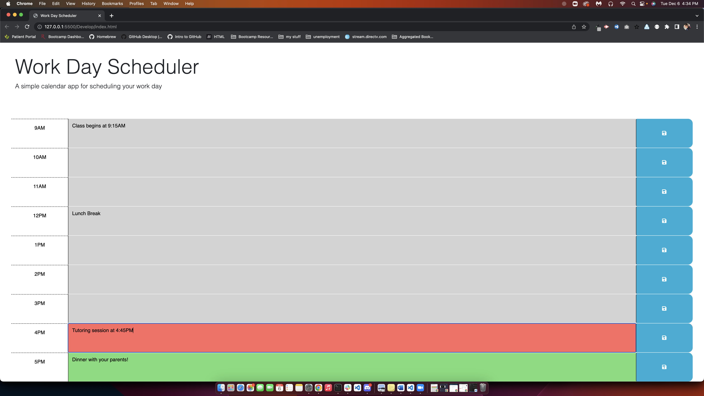

# 05 Third-Party APIs: Work Day Scheduler

## User Story

Used jQuery and Javascript methods to compile a 9AM-5PM work day calendar application. This will allow a user to save events for each hour of the day. The application will highlight each row and idenitfy whether the time has passed, is present, or will occur. The colors highlighting the rows are grey to define past, red to define present, and green to define future events.

## Acceptance Criteria
As an organized person I WANT to create a planner that will organize my day by the hour. 

